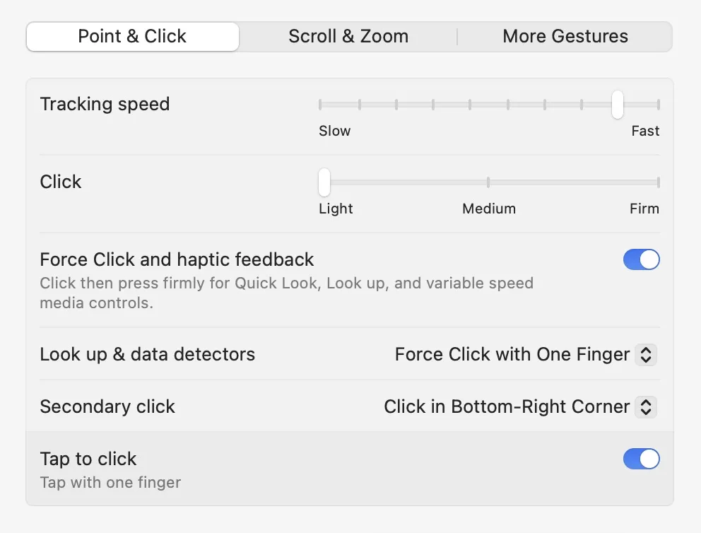

# NEW MACBOOK 💻 DEV SETUP

Set up for macOS system preferences, homebrew, terminal, programs, plug-ins and more.

This is my modified version of [maoxiaoke](https://github.com/maoxiaoke/setup-a-mac-for-frontend-dev) set up, also I included commands and free DLCs.

## 1. System Preferences 🎛️

<!--  -->

1. Accessibility

   1. Change Cursor size -> 1 step bigger

1. Login iCloud and App Store

1. Login Internet Accounts

1. Control Center

   1. Show audio icon [x]

1. Siri & Spotlight

   1. Siri [off]

   1. [off] Search results

   1. [Spotlight Privacy...]

1. Dock + Menu Bar

   1. [Remove] not used Apps from the dock

   1. [ ] Siri

   1. Minimize windows [Genie→Scale]

   1. Minimise windows into application [x]

   1. Automatically hide and show the Dock [x]

    <!--  -->

1. Security

   1. [immediately] Required password

   1. [x] Filevault

   1. [x] Firewall

   1. Privacy -> turn off no neded [Location_Services]

1. Users & Groups

   1. [ ] Login Options > Show fast user switching as [icon]

1. Change Wallpaper

1. Battery

   1. Change as you want.

1. Users & Group

   1. [ ] Allow users to reset using Apple ID

1. Keyboard + Region

   1. Language inputs

      1. shortcurt → Input Sources → [x] Select previous input source (! alt + space)

   1. Region (Ireland: have euro, english, gregorian, close time zone, not imperialist UK)

1. Trackpad

   1. Point & Click

      1. Tracking Speed [Change]
      1. Click [light]

      1. Secondary click [Bottom-Right]

      1. Tap to Click [x]

         

   1. More Gestures

      1. Swipe 2 finger last page [off]

      1. Swipe between Screen [3-Finger]

      1. [Change] Right click → on the right bottom corner

         <!--  -->
         


### System Plugins

1. Usage: show system usage
1. Amphentamine: prevent computer to sleep and more cool options
1. Pomodoro
1. Helium: PiP

### Safari Plugins

1. Adguard
1. AdGuard
1. PiPifier
1. Link Text Selector

## Terminal Commands 📼

 

### SIMPLE CMDS

- `clear`

  `man` manual

  `df -h` how much space is in your disk

  `whoami` tell you the user you are

  `ps` show all the processes in your mac

  `ps -ax`

  `top` showing your processes in realtime

  `top -o rsize` showing your memory apps in realtime

  `bash` change to

  `zsh` change to

  `uptime` how much time has your mac wotking

  `history` command history

  ctrl + C to exit

### FILES

`cd` go to directory

`ls` list current folder files

`open` open a file

`cp` copy files

`ditto` better version of copy files

`nano` edit a file

`mv` move files

`diff` compare files

### INTERNET

1. `ping` check if the website is working

1. `ifconfig` know your ip addres

1. `ifconfig en0 | grep inet | awk ‘{ print $2 }’` only show ipv6 and 4

1. `traceroute [website]` trace the route to go to a website

1. `dig [website]` dig in DNS

1. `curl [file]` download a file from the internet

1. `curl [wttr.in/[city]](http://wttr.in/[city])` show the weather

### SECURITY

1. [Allow Apps from Anywhere (Gatekeeper](http://osxdaily.com/2016/09/27/allow-apps-from-anywhere-macos-gatekeeper/))
   `sudo spctl --master-disable`
1. Delete all the download history (from any app that lets you download files. This can include torrents, cat photos, porn—anything.)
   **`sqlite3 ~/Library/Preferences/com.apple.LaunchServices.QuarantineEventsV* 'delete from LSQuarantineEvent'`**
1. Use Touch ID for sudo
   [https://youtu.be/qOrlYzqXPa8?t=644](https://youtu.be/qOrlYzqXPa8?t=644)
   `sudo nano /etc/pam.d/sudo`

### Homebrew

1. Example usage:

   brew search TEXT|/REGEX/

   brew info [FORMULA|CASK...]

   brew install FORMULA|CASK...

   brew update

   brew upgrade [FORMULA|CASK...]

   brew uninstall FORMULA|CASK...

   brew list [FORMULA|CASK...]

1. Troubleshooting:

   brew config

   brew doctor

   brew install --verbose --debug FORMULA|CASK

1. Contributing:

   brew create URL [--no-fetch]

   brew edit [FORMULA|CASK...]

1. Further help:

   brew commands

   brew help [COMMAND]

   man brew [link](https://docs.brew.sh)

### FUN

- Mac speech
  `say [put the phrase]`
- 🔋BEEP → Plug the Power
  iPhone charging sound

  ```powershell
  defaults write com.apple.PowerChime ChimeOnAllHardware -bool true; open /System/Library/CoreServices/PowerChime.app
  ```

- SCREENSHOOTS
  Screenshot jpg(or tiff, gif)

  ```powershell
  defaults write com.apple.screencapture type jpg;killall SystemUIServer
  ```

  Create a New Default Name For Screenshots

  ```powershell
  defaults write com.apple.screencapture name "capturajun"
  ```

- Kill The Dashboard

  ```powershell
  defaults write com.apple.dashboard mcx-disabled -boolean TRUE
  ```

- Stay awake while using the terminal
  `caffeinate`

## VS CODE plugins


sass compiler

live server

prettier

**Need to update**

### json settings for vs code sass compiler

```jsx
{
    "workbench.iconTheme": "material-icon-theme",
    "editor.minimap.enabled": false,
    "breadcrumbs.enabled": false,
    "editor.renderWhitespace": "none",
    "editor.renderControlCharacters": true,
    "workbench.preferredHighContrastColorTheme": "Visual Studio 2019 Light",
    "extensions.ignoreRecommendations": true,
    "explorer.confirmDragAndDrop": false,
    "liveSassCompile.settings.formats": [
    {
        "format": "expanded",
        // "extensionName": "min.css",
        // "savePath": "/css"
    }
    ],
    "liveSassCompile.settings.generateMap": false,
    "workbench.colorTheme": "Visual Studio 2019 Dark",
    "workbench.preferredDarkColorTheme": "Visual Studio 2019 Dark",
    "workbench.preferredLightColorTheme": "Visual Studio 2019 Light",
    "liveSassCompile.settings.autoprefix": [],
    "liveServer.settings.donotShowInfoMsg": true
}
```

### SASS

POSITION

`"Position Fixed": {`

`"prefix": "pof",`

`"body": ["position: fixed;\n"],`

`"description": "Position Fixed"`

`},`

`"Position Relative": {`

`"prefix": "por",`

`"body": ["position: relative;\n"],`

`"description": "Position Relative"`

`},`

`"Position Absolute": {`

`"prefix": "poa",`

`"body": ["position: absolute;\n"],`

`"description": "Position Absolute"`

`}`

#### .prettierrc

```jsx
{
"singleQuote": true,
"arrowParens": "avoid"
}
```
